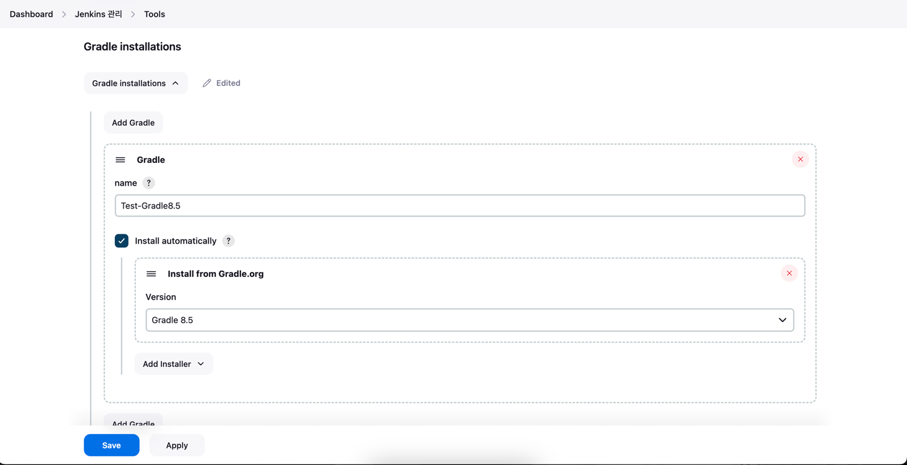
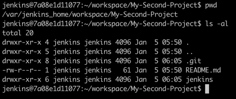
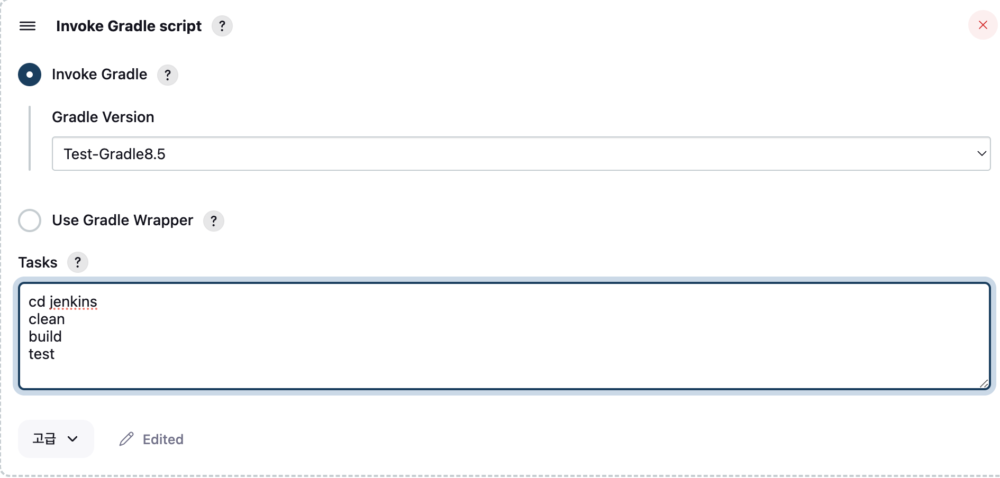

# Jenkins에서 Gradle 배포 64번만에 성공하기..(feat. Jenkins, Gradle, 배포)

## 무슨 상황인가?

새로운 프로젝트에 들어가기 앞서 잠깐 까먹었던 Jenkins를 다시 사용해보려고 공부하고 있던 중이었다. 기존에는 Maven 프로젝트를 사용했지만 Gradle 프로젝트를 배포해야 하기 때문에 새롭게 테스트를 하고 있었다.

그런데 이놈 생각보다 까다롭다.. 무려 64번째 시도 끝에 성공했지만 이 글을 보는 사람들은 한 번에 성공하길 바란다.

## Jenkins 설정해 보자!

### 1. 내가 사용한 테스트 프로젝트

Jenkins 배포 테스트에 사용할 [프로젝트](https://github.com/ohju96/default-jenkins-test)를 만들어 주었다. 의존성도 없고 그냥 RestApi 하나 띄워둔 Gradle 프로젝트이다.

**이 프로젝트는 Java 17 버전과 Gradle 8.5 버전을 사용한다.**

### 2. Jenkins 설정



Jenkins 대쉬보드에서 Jenkins 관리 -> Tools에 들어오면 Gradle을 설정할 수 있다. 내가 사용하는 프로젝트는 Gradle 8.5 버전을 사용하기 때문에 맞추어 설정해 주고 Save 해준다.


Freestyle 프로젝트를 하나 생성해서 설정을 진행하는데 위에 프로젝트 Github 주소를 넣어준다.


소스코드 관리 탭에서 Git을 선택하고 브랜치를 알맞게 넣어준다. 처음에 master로 설정되어 있지만 현재 Github에서 자동으로 생성되는 브렌치는 main이라 잘 보고 넣어줘야 한다.


이제 아까 위에서 대쉬보드 Tools에서 설정한 Gradle를 선택해주고 스크립트를 작성하고 저장 후 실행하면 된다.

## 비상, 비상! 문제 발생

### 1. 뭐가 된다? 문제가 된다.


대충 몇 번을 실행해도 이런 화면을 보게 될 것이다. 끔찍하다.


로그를 확인해 보면 이렇게 나온다. 검색 유입을 위해 굳이 코드를 직접 적어보자면 아래와 같다.

```text
Directory '/var/jenkins_home/workspace/My-Second-Project' does not contain a Gradle build. A Gradle build should contain a 'settings.gradle' or 'settings.gradle.kts' file in its root directory. It may also contain a 'build.gradle' or 'build.gradle.kts' file.
```

```text
failure: build failed with an exception.
```

```text
build step 'invoke gradle script' marked build as failure
```

```text
FAILURE: Build failed with an exception.

* What went wrong:
Directory '/var/jenkins_home/workspace/My-Second-Project' does not contain a Gradle build.

A Gradle build should contain a 'settings.gradle' or 'settings.gradle.kts' file in its root directory. It may also contain a 'build.gradle' or 'build.gradle.kts' file.

To create a new Gradle build in this directory run 'gradlew init'

For more information about the 'init' task, please refer to https://docs.gradle.org/8.5/userguide/build_init_plugin.html in the Gradle documentation.

For more details on creating a Gradle build, please refer to https://docs.gradle.org/8.5/userguide/tutorial_using_tasks.html in the Gradle documentation.

* Try:
> Run gradlew init to create a new Gradle build in this directory.
> Run with --stacktrace option to get the stack trace.
> Run with --info or --debug option to get more log output.
> Get more help at https://help.gradle.org.

BUILD FAILED in 1s
Build step 'Invoke Gradle script' changed build result to FAILURE
Build step 'Invoke Gradle script' marked build as failure
Finished: FAILURE
```

이런 에러들이 뜨는데 잘 보면 `/var/jenkins_home/workspace/My-Second-Project`에 build.gradle가 없어서 생기는 문제이다.

### 3. 상황을 파악하고 대처를 해야한다.



Jenkins를 Docker로 설치해서 운영했는데 Jenkins 컨테이너에 접속해서 에러에서 안내하는 경로로 가보면 구조가 위와 같이 구성되어 있다.

먼저, Git을 clone 해오게 되면 보통 `레포지토리명/..` 이렇게 구성되어 받아지는데 Jenkins에서는 workspace에 Item명을 Root로 삼아 프로젝트가 받아진다.

Spring 프로젝트를 먼저 생성하고 `git init`을 하고 `remote`한 게 아니라 git repository를 생성하고 clone 받아 프로젝트를 생성했기 때문에 폴더가 한 댑스 들어가 있는 게 문제가 되었다.

### 4. 간단한 해결책은?

있다. 간단한 해결책은 물론 있다. 바로 프로젝트가 한 댑스 들어가 있는 것을 한 꺼풀 벗겨내어 다시 Git에 올려주는 것이다. 하지만 그건 근본적인 해결 방법은 아니다. 하나의 레포지토리에 프로젝트 폴더가 꼭 하나만 있는 게 아니기 때문에 원하는 폴더를 잡을 수 있어야 한다.

그래서 나는 build.gradle 경로를 잡아주어 해결하기로 했다.

## 해결 방법을 세웠으면 시도하라!

### 1. 일단 뭐든 조져보자.



먼저, 간단하게 생각해 볼 수 있는 디렉토리 이동이다. 메인 패키지에서 jenkins 폴더로 들어가면 해결되는 것이기 때문에 이렇게 시도했다. 사실 구글링을 하면서 떠올린 방법이다.

결과는 실패, 하지만 괜찮다. 다음 스텝 밟아보자.


절대 경로로 다시 잡아본다. 프로젝트에 있는 jenkins 폴더에 접근하는 게 내 목표이다. 진짜 간단해 보이는데 뭔가 방법을 몰라서 못 하는 것 같다. 검색해도 잘 나오지 않았기 때문에 내가 해볼 수 있는 것은 여러 방법으로 시도해 보는 것.

결과는 실패, 진짜 괜찮다. 다음 스텝 밟아보자.


위에서 대쉬보드 Tools에서 설정한 Gradle을 사용하지 않고 직접 경로를 잡아서 시도해 본다.

결과는 실패, 이것저것 시도하길 어느새 63번째 시도였다.

## 답은 있다. 내가 모르는 것일 뿐!

### 1. 고생 끝 해결 완료


Gradle 설정과 빌드 스크립트는 더 이상 건드리지 않는다. 여기서 고급 버튼을 눌러서 아래로 스크롤을 해보면


빌드 Root를 설정할 수 있는 곳이 있었다. 지금까지 어디에다 하고 있었던 것인지.. 이를 마치고 실행하면


드디어 성공했다. 생각보다 사례가 없었고.. 강의에서는 Maven을 사용했기 때문에 삽질을 한동안 해댔다.

### 2. 결론

간단해도 한 번은 시도해 봐야 하는 이유이다. 방법을 모르면 간단하지 않을 수 있다. 해결책을 생각해 내어도 이를 실행할 방법을 모르면 말짱 꽝이다. 많은 오류를 만나고 많이 해결해 봐야 요령이 생긴다 했다. 64번의 시도가 아깝지 않았다.