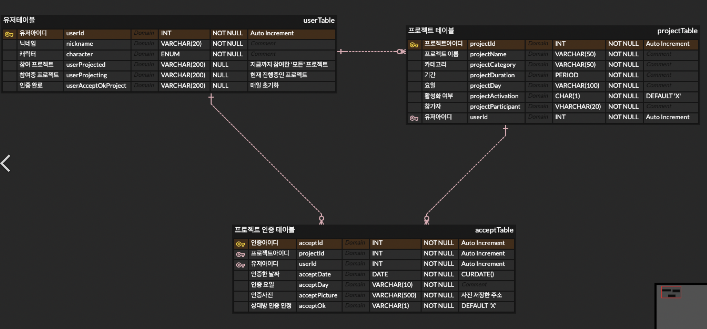

## 도달도달
### 데이터베이스만 참여하게 된 이야기
간단하게 정의하자면 도달도달은 1 : 1 목표 달성 챌린지이다. 내가 프로젝트에 참여한 것은 아니고 어쩌다 보니 데이터베이스 일부분만 간접적으로 참여하게 되었다. ‘숨겨진 멤버’ 이런 느낌이다.

<!-- {"width":654} -->
형욱님이 팀원 중 백엔드 하시는 분이 설계해온 테이블이라고 봐달라고 했다.

“와우”

보자마자 이건 좀 아닌 것 같다는 생각이 강하게 들었다. 일단 `유저테이블`만 봐도 그렇다. 참여프로젝트, 참여중 프로젝트를 보면 제 1 정규화부터 되어 있지 않다는 것을 알 수 있다. 이런 테이블 구조를 두고만 볼 수는 없다.

“형욱님, 이거 요구사항 좀 주세요.”

기가막히게는 아니더라도 적어도 이런 테이블 보다는 조금 더 나은 설계로 프로젝트를 진행할 수 있도록 도와드려야겠다.

### 요구사항
“잠깐만요.”

```text
홈페이지에서는 오늘의 도달률, 탐사 중인 달(프로젝트 참가중), 탐사 완료(프로젝트 완료), 캐릭터가 나옴.

오늘의 도달률은 유저테이블의 인증완료와 참여중 데이터를 연산하면 될 것 같고 탐사중은 탐여중프로젝트,
탐사완료는 참여-참여중 일 것 같음.

챌린지 탭에서는 진행중인 프로젝트들, 신규 프로젝트 만들기 버튼 진행중인 프로젝트는 인증하면 색이 회색으로 바뀌는데 이건 인증하면 데이터가 추가되는 유저테이블의 인증완료 데이터를 참조하면 될 것 같고
참여중인 프로젝트들은 그냥 데이터 나열하면 될 것 같음.

신규프로젝트 만들기 페이지는 유저가 정해진 데이터 형식에 데이터를 꽂아넣는거니 값 그대로 테이블에 넣으면 될 것 같음. 유저가 프로젝트 내용을 작성하고, 공유하기를 누른 '순간' 프로젝트 테이블에 데이터가 추가됨.

활성화 여부가 X이고, 참가자가 프로젝트를 생성한 유저 한 명 뿐인 프로젝트 데이터가 추가 될 것 같음.동시에 유저테이블의 참여 프로젝트, 참여중프로젝트 열에도 프로젝트 아이디가 추가가 됨.

다만 그 프로젝트 아이디의 활성화 여부는 X이니 챌린지 보관함에 수락대기중으로 뜰 것 같음.
그 링크를 받은 유저가 (로그인하고) 수락을 누르면 프로젝트 참가자 데이터에 유저가 추가되고, 활성화여부가 O가 됨.

동시에 그 유저의 테이블의 참여 프로젝트, 참여중 프로젝트에 방금 참여한 프로젝트의 ID가 추가될 것 같음. 

프로젝트 자세히 보기(S페이지)에서는 인증 했던 날들이 이미지적으로 구성되고, 인증할 수 있는 기능이 있음. 인증하기 버튼을 누르면 사진을 선택하고, 업로드 하면 프로젝트 인증 테이블에 데이터들이 추가됨. 여기서 상대방 인증 인정은 X로 추가됨. 이렇게 1차 인증이 완료되면, 그 인증 테이블에는 프로젝트 아이디가 포함돼 있을테니 그거 타고 가서 상대방 참가자의 아이디를 알아낸 다음 그 참가자에게 인증요청(인증 테이블의 인증ID을 보냄.

확인을 누르면 그 인증아이디의 데이터의 상대방 인증 인정(acceptOk)가 O로 바뀌고, 동시에 인증요청을 했던 유저의 인증완료에 데이터(인증아이디)가 들어감.
```

형욱님의 ‘잠깐만요’ 다음으로 내가 도달도달 프로젝트의 테이블을 설계하기 위해 얻어야 할 정보 중 하나인 요구사항을 얻을 수 있었다. 어지러운 텍스트 요구사항을 슬쩍 정리해 보자면 다음과 같다.

그전에 `프로젝트`는 사실 프로젝트가 아니라 `챌린지`로 부른단다. 때문에 `프로젝트 -> 챌린지`로 이름을 변경해서 적어나가보겠다.

> 유저 부분
1. 유저는 챌린지를 얼만큼 수행했는지 ‘도달률’을 알 수 있어야 한다.
2. 유저는 진행중인 챌린지를 알 수 있어야 한다.
3. 유저는 완료한 챌린지를 알 수 있어야 한다.
4. 유저는 캐릭터를 가지고 있을 수 있다.

> 챌린지 부분
5. 챌린지 탭에서 진행중인 챌린지를 확인할 수 있어야 한다.
6. 챌린지 탭에서 신규 챌린지를 생성할 수 있어야 한다.
7. 챌린지를 생성하고 초대를 공유할 수 있다. (참여를 위한 공유이다.)
8. 챌린지 초대는 유저가 로그인하고 수락 또는 거절을 할 수 있다.
9. 챌린지 수락을 하면 참가자 데이터에 유저가 추가되어야 한다.

> 인증 부분
10. 진행중인 챌린지에 대해서 수행했다는 인증을 할 수 있다.
11. 챌린지 인증은 인증 사진을 저장할 수 있어야 한다.
12. 챌린지 인증에 대해서 상대방이 확인을 해 줘야 인증 성공 및 실패를 결정해 준다.
13. 실패 이후 재인증 요청을 보낼 수 있다.

조금 정리하고 보니까 어떻게 변경해야 할 지 좀 더 뚜렷하게 알 수 있어진 것 같다. 일단 유저 테이블부터 만들어 봐야겠다.

> 1. 요구 사항 분석
> 2. 개념적 설계
> 3. 논리적 설계
> 4. 물리적 설계

원래라면 이런 과정을 거쳐서 구현을 할테지만 도달도달프로젝트는 마감은 거의 7일 밖에 남지 않았고 데이터베이스 구현에 많은 시간을 쏟을 수 없다 하여 간단하게 진행하기로 했다.
## 테이블 설계
데이터 타입이나, 조건, 코멘트 등은 이 설계를 전달 받아 구현할 백엔드 개발자분이 알아보기 쉽게 Spirng에서 많이 사용하는 데이터 타입으로 적어드렸다. *~하지만 알고 보니 노드 개발자였고, 백엔드 개발은 형욱님이 짬처리로 전부 다 개발한 건...~*
### 멤버 : member
| 컬럼명 | 데이터 타입 | 조건 | 코멘트 |
| --- | --- | --- | --- |
| id | Long | PK | 아이디 |
| nickname | String | UQ/NN | 닉네임 |
| provider | Enum | NN | GOOGLE/KAKAO |
| provider_id | String | UQ/NN | 프로바이더에서 제공하는 유저 고유 아이디 |
| character | Enum | NN | provider 참고 |
| is_deleted | boolean | NN | 소프트 딜리트(TRUE=회원탈퇴/FALSE=회원유지) |
| created_at | LocalDateTime | Default | 생성일 |
| updated_at | LocalDateTime | Default-update | 수정일 |
- user보다 member가 조금 더 서비스에 대한 소속감을 나타나는 것 같아서 member로 수정했다.
- 이메일로 로그인하는 과정이 없고 KAKAO를 통한 로그인만 구현한다고 하셨지만 추후에 GOOGLE 로그인 정도는 추가될 것 같다고 하셔서 provider 컬럼을 추가해 두었다.
- 소셜 로그인을 구현하자면 해당 소셜에서 제공하는 유저 고유 아이디가 있다. 그것을 저장하기 위해 provider_id를 추가해 주었다. 중복 방지로 UQ를 추가했다.
- character는 캐릭터(프로필)를 가질 수 있다고 해서 넣었는데 추후에 champion으로 네이밍을 변경해 주었다.

### 챌린지 : challenge
| 컬럼명        | 데이터 타입        | 조건              | 코멘트              |
|------------|---------------|-----------------|------------------|
| id         | Long          | PK              | 아이디              |
| name       | String        | NN              | 챌린지명             |
| category   | Enum          | NN              | 카테고리(1개 기준)      |
| is_deleted | boolean       | Default - FALSE | TRUE=삭제/FALSE=존재 |
| expired_at | LocalDateTime | NN              | 종료일              |
| started_at | LocalDateTime | NN              | 시작일              |
| created_at | LocalDateTime | “               | 생성일              |
| updated_at | LocalDateTime | “               | 수정일              |
- 멤버는 챌린지를 생성할 수 있다. 하지만 1대1 관계로 진행되는 챌린지라 챌린지 테이블 자체에 멤버 데이터를 넣고 참여자를 따로 관리하면 데이터 중복이 있을 것 같았다.
- 챌린지에 참여 유저까지 넣으면 되지 않나? 이런 의문이 있을 수도 있지만 각 유저마다 챌린지 성공 및 실패가 다르게 결정될 수도 있고 언제 어느 유저가 참여했는지 알기 위해서 참여자에 대한 테이블은 분리해 주었다.
- 챌린지는 카테고리를 가지고 있다. 이 카테고리는 운영자가 결정하는 것이고 그렇게 많지 않다고 해서 Enum으로 넣어주었다.
- 챌린지뿐만 아니라 모든 삭제에 대해서는 이력을 관리하기 위해 Soft Delete 방식으로 삭제 체크하는 컬럼을 따로 두어 관리하도록 했다.
- 챌린지는 시작일과 만료일이 있다고 해서 일자를 추가로 넣어주었다.

### 챌린지 참여자 : challenge_participant
| 컬럼명          | 데이터 타입        | 조건              | 코멘트       |
|--------------|---------------|-----------------|-----------|
| id           | Long          | PK              | 아이디       |
| challenge_id | Long          | FK              | 참여한 챌린지   |
| member_id    | Long          | FK              | 챌린지 참여 멤버 |
| role         | Enum          | OWNER or MEMBER | 멤버 권한     |
| status       | Enum          | 대기/실패/성공        | 챌린지 상태    |
| created_at   | LocalDateTime | "               | 생성일       |
| updated_at   | LocalDateTime | “               | 수정일       |
- ```메모 내용 - 설계 중 간단하게 적어두었던 메모이다.
  프로젝트 생성시 프로젝트 참여자 로우 1개를 OWNER로 무조건 생성해서 프로젝트 생성자를 구분해야 한다. OWNER가 프로젝트를 만들고 링크를 전달하고 해당 링크를 멤버가 수락하면 프로젝트 참여자(MEMBER)로 등록이 가능하다. 대기/실패/성공
  ```
- 챌린지를 생성할 때 참여자 테이블에 로우를 쌓음으로써 프로젝트 오너와 멤버를 구분할 수 있게 해 주었다.
- 챌린지 참여자는 참여중인 챌린지가 있을 것이고, 참여하는 멤버도 가지고 있다.
- 챌린지 참여자는 챌린지 성공 및 실패를 따로 구분할 수 있어야 해서 status 컬럼을 넣어 주었다.

### 챌린지 진행일 : challenge_progression
| 컬럼명             | 데이터 타입        | 조건             | 코멘트                 |
|-----------------|---------------|----------------|---------------------|
| id              | Long          | PK             | 아이디                 |
| challenge_id    | Long          | FK             | 챌린지 아이디             |
| day_of_the_week | Enum          | NN             | (월~일)               |
| is_active       | boolean       | Default = TRUE | TRUE=활성화/FALSE=비활성화 |
| created_at      | LocalDateTime | “              | 생성일                 |
| updated_at      | LocalDateTime | “              | 수정일                 |
- 챌린지는 인증하는 요일이 정해진다. 월요일부터 일요일까지 여러개 선택이 가능하다.
- A챌린지가 월, 목에 진행된다면 진행일 테이블에 2개의 컬럼이 생성되는 것이다.
- 수정을 고려해 활성화 여부를 넣어주었다.

### 챌린지 인증 : challenge_certification
| 컬럼명                    | 데이터 타입        | 조건          | 코멘트                  |
|------------------------|---------------|-------------|----------------------|
| id                     | Long          | PK          | 아이디                  |
| challenge_id           | Long          | FK          | 챌린지 아이디              |
| member_id              | Long          | FK          | 인증한 멤버 아이디           |
| authenticate_image_url | String        | NN          | 인증 사진 URL(AWS URL 등) |
| is_authenticate        | Boolean       | Default = N | TRUE=인증됨/FALSE=거절됨   |
| create_at              | LocalDateTime | “           | 생성일                  |
| updated_at             | LocalDateTime | “           | 수정일                  |
- ```메모 내용 - 설계 중 간단하게 적어두었던 메모이다.
  여행했어요 -> 0% 초과 (1개 이상) 진행한 챌린지가 있다.
  도달했어요 -> 100% 진행한 챌린지가 있다.
  ```
- 이미지를 통해 인증하게 된다. AWS S3와 같은 곳에 업로드하고 받을 수 있는 이미지 저장 링크를 받는 컬럼을 만들어 주었다.
- 인증은 챌린지와 인증한 멤버를 가지고 있다.
- 인증은 상대방이 승인과 거절을 할 수 있기 때문에 기본을 NULL로 관리하고 인증 되거나 거절되는 것을 T/F로 관리하는 것을 생각했다.
## 공유하기
### 피드백
전체적으로 이전보다 괜찮아졌다. 정규화를 통해 중복되는 데이터를 없애기도 했고 여러가지 데이터를 알맞게 쌓을 수 있게 되었다. 생성한 테이블을 뽑아서 형욱님에게 데이터베이스 및 테이블 생성 쿼리와 함께 전달해 드렸다.

“어제 저녁에 미팅을 했는데요. 아무래도 지금 기능을 전부 구현하기엔 기간 맞추기가 어려울 것 같아서 기획 수정을 했어요.”
“에?.. 뭐죠? 변경 사항 공유해 주세요. 수정해 드릴게요.”

다음 날 형욱님과 나눈 대화이다. 허허.. 사람 사는거 다 똑같구나. 무한 반복과 무한 수정 굴레가 슬쩍 보였다.
### 수정사항
수정 사항은 짧은 카톡을 주고 받으며 들었던 것 같다. 회사에서 들었던가. 기억이 잘 안 난다. 수정 사항에 대해서는 긴 텍스트로 된 요구사항을 받은 적이 없어서 기억나는 대로 간단하게 정리해 봤다.

1. 뱃지에 대한 기능이 생겼다.
2. 뱃지는 간단하게 챌린지 시작한 경우 ‘첫 챌린지 달성’과 같은 소목표이다.
3. 챌린지에 기간을 삭제하고, 인증하기로 한 요일 항목을 삭제한다. 달성 목표 개수를 정하게 되고 무조건 개수를 달성한 사람은 완료가 된다.
4. 참여자 테이블에서 챌린지 상태를 알 수 있어야 할 것 같다.
5. 챌린지 인증 테이블에서 인증 상태 기본이 성공으로 수정되었으면 좋겠다.

흠.. 당장 떠오르는 건 이렇다.

일단 뱃지 기능은 간단하게 뱃지만 관리하는 테이블을 생성하고 멤버와 매핑시키는 테이블이 있는 게 깔끔하다. 그래야 중복 데이터가 안 생긴다. 챌린지 기간은 요일 테이블은 드랍해 버리는 게 낫겠다. 컬럼에 시작일, 종료일도 드랍한다. 대신 인증 개수를 체크할 수 있는 컬럼을 추가한다.

글을 적다 생각났는데 챌린지 상태는 이때 추가가 된 것 같다. 처음엔 아마 멤버 두 사람 다 완료해야 챌린지 성공 이렇게 되었던거 같다. *순서를 헷갈림..*

챌린지 인증은 T/F 중 기본으로 하는 것 보다 몇 번째 인증 데이터인지 체크하는 컬럼을 인증 테이블에도 넣어주고 T/F 등 없는 경우 로직에서 처리하는 쪽으로 빼서 처리하는 게 더 나을 것 같다는 생각이다. 왜냐하면 T를 기본으로 넣으면 기획이 이렇게 되어야 한다.

‘상대가 수락을 하지 않으면 자동으로 인증 성공이 된다.’

하지만 그건 아니라고 했다. 때문에 T를 기본으로 넣기보다. 체크할 수 있는 컬럼을 하나 더 만들어주고 로직에서 처리하는 게 낫다고 생각했다. 재인증이 있는 이상 그렇게 보는 게 더 편하기도 하고 어느 정도 데이터 중복 아닌 중복이 생기지만 `이론 vs 실용`을 따져보면 이론에 크게 해가 되지 않고 실용에 편의성에 관여함이 크다고 생각하면 실용을 챙기자 주의이다. 반정규화? 조인까진 아닌데 그런 것도 있으니 괜찮다.

## 재설계
자, 테이블을 다시 설계해 보자. 이번엔 쿼리까지 싹 정리해서 던진다.
### 멤버 : member
| 컬럼명 | 데이터 타입 | 조건 | 코멘트 |
| --- | --- | --- | --- |
| id | Long | PK | 아이디 |
| nickname | String | UQ/NN | 닉네임 |
| provider | Enum | NN | GOOGLE/KAKAO |
| provider_id | String | UQ/NN | 프로바이더에서 제공하는 유저 고유 아이디 |
| character | Enum | NN | provider 참고 |
| is_deleted | boolean | NN | 소프트 딜리트(TRUE=회원탈퇴/FALSE=회원유지) |
| created_at | LocalDateTime | Default | 생성일 |
| updated_at | LocalDateTime | Default-update | 수정일 |
``` sql
# 멤버 테이블 생성 
# nickname, champion, provider 필요에 따라 수정 후 적용. 
CREATE TABLE member ( 
	id BIGINT NOT NULL AUTO_INCREMENT PRIMARY KEY, nickname VARCHAR(20) NOT NULL UNIQUE, 
	provider ENUM('GOOGLE', 'KAKAO') NOT NULL, 
	provider_id VARCHAR(50) NOT NULL UNIQUE, 
	champion ENUM('CHAMP1', 'CHAMP2', 'CHAMP3', 'CHAMP4', 'CHAMP5', 'CHAMP6') NOT NULL, 
	is_deleted BOOLEAN DEFAULT FALSE NOT NULL, 
	created_at TIMESTAMP DEFAULT CURRENT_TIMESTAMP NOT NULL, 
	updated_at TIMESTAMP DEFAULT CURRENT_TIMESTAMP ON UPDATE CURRENT_TIMESTAMP NOT NULL 
);
```

### 챌린지 : challenge
| 컬럼명              | 데이터 타입        | 조건                                     | 코멘트              |
|------------------|---------------|----------------------------------------|------------------|
| id               | Long          | PK                                     | 아이디              |
| name             | String        | NN                                     | 챌린지명             |
| category         | Enum          | NN                                     | 카테고리(1개 기준)      |
| is_deleted       | boolean       | Default - FALSE                        | TRUE=삭제/FALSE=존재 |
| target_count     | int           | Default -= 10                          | 몇 번 하는지          |
| challenge_status | Enum          | WAITING / PROGRESS / FAILURE / SUCCESS | 챌린지 상태           |
| created_at       | LocalDateTime | “                                      | 생성일              |
| updated_at       | LocalDateTime | “                                      | 수정일              |
``` sql
# 챌린지 테이블 생성 
# name, category 필요에 따라 수정 후 적용. 
CREATE TABLE challenge ( 
	id BIGINT NOT NULL AUTO_INCREMENT PRIMARY KEY, 
name VARCHAR(20) NOT NULL, 
	category ENUM('CT1', 'CT2', 'CT3', 'CT4', 'CT5', 'CT6') NOT NULL, 
	is_deleted BOOLEAN DEFAULT FALSE NOT NULL, 
	target_count INT DEFAULT 10 NOT NULL,
	challenge_status ENUM('WAITING', 'PROGRESS', 'FAILURE', 'SUCCESS') DEFAULT 'WAITING' NOT NULL,
	created_at TIMESTAMP DEFAULT CURRENT_TIMESTAMP NOT NULL, 
	updated_at TIMESTAMP DEFAULT CURRENT_TIMESTAMP ON UPDATE CURRENT_TIMESTAMP NOT NULL );
```

### 챌린지 참여자 : challenge_participant
| 컬럼명          | 데이터 타입        | 조건              | 코멘트       |
|--------------|---------------|-----------------|-----------|
| id           | Long          | PK              | 아이디       |
| challenge_id | Long          | FK              | 참여한 챌린지   |
| member_id    | Long          | FK              | 챌린지 참여 멤버 |
| role         | Enum          | OWNER or MEMBER | 멤버 권한     |
| created_at   | LocalDateTime | "               | 생성일       |
| updated_at   | LocalDateTime | “               | 수정일       |
``` sql
# 챌린지 참여자 테이블 생성 
CREATE TABLE challenge_participant ( 
	id BIGINT NOT NULL AUTO_INCREMENT PRIMARY KEY, 
	member_id BIGINT NOT NULL, 
	challenge_id BIGINT NOT NULL, 
	role ENUM('OWNER', 'MEMBER') NOT NULL, 
	created_at TIMESTAMP DEFAULT CURRENT_TIMESTAMP NOT NULL, 
	updated_at TIMESTAMP DEFAULT CURRENT_TIMESTAMP ON UPDATE CURRENT_TIMESTAMP NOT NULL, 
	FOREIGN KEY (member_id) REFERENCES member(id),
	FOREIGN KEY (challenge_id) REFERENCES challenge(id) 
);
```
- 기간이 없어서 실패가 없다. 챌린지 상태

### 챌린지 인증 : challenge_certification
| 컬럼명                    | 데이터 타입        | 조건          | 코멘트                  |
|------------------------|---------------|-------------|----------------------|
| id                     | Long          | PK          | 아이디                  |
| challenge_id           | Long          | FK          | 챌린지 아이디              |
| member_id              | Long          | FK          | 인증한 멤버 아이디           |
| authenticate_image_url | String        | NN          | 인증 사진 URL(AWS URL 등) |
| is_authenticate        | Boolean       | Default = N | TRUE=인증됨/FALSE=거절됨   |
| participation_count    | INT           | Default = 0 |                      |
| create_at              | LocalDateTime | “           | 생성일                  |
| updated_at             | LocalDateTime | “           | 수정일                  |
``` sql
# 챌린지 인증 테이블 생성 
# authenticate_image_url 필요에 따라 수정 후 적용. 
CREATE TABLE challenge_certification ( 
	id BIGINT NOT NULL AUTO_INCREMENT PRIMARY KEY, 
	member_id BIGINT NOT NULL, 
	challenge_id BIGINT NOT NULL, 
	authenticate_image_url VARCHAR(200) NOT NULL, 
	is_authenticate BOOLEAN DEFAULT NULL, 
	participation_count INT DEFAULT 0 NOT NULL,
	created_at TIMESTAMP DEFAULT CURRENT_TIMESTAMP NOT NULL, 
	updated_at TIMESTAMP DEFAULT CURRENT_TIMESTAMP ON UPDATE CURRENT_TIMESTAMP NOT NULL, 
	FOREIGN KEY (member_id) REFERENCES member(id), 
	FOREIGN KEY (challenge_id) REFERENCES challenge(id) 
);
```

### 멤버_뱃지 : member_badge
| 컬럼명        | 데이터 타입        | 조건  | 코멘트    |
|------------|---------------|-----|--------|
| id         | Long          | PK  | 아이디    |
| member_id  | Long          | FK  | 멤버 아이디 |
| badge_id   | Long          | FK  | 뱃지 아이디 |
| created_at | LocalDateTime | “   | 생성일    |
| updated_at | LocalDateTime | “   | 수정일    |
``` sql
CREATE TABLE member_badge ( 
	id BIGINT NOT NULL AUTO_INCREMENT PRIMARY KEY, 
	member_id BIGINT NOT NULL, 
	badge_id BIGINT NOT NULL, 
	created_at TIMESTAMP DEFAULT CURRENT_TIMESTAMP NOT NULL, 
	updated_at TIMESTAMP DEFAULT CURRENT_TIMESTAMP ON UPDATE CURRENT_TIMESTAMP NOT NULL, 
	FOREIGN KEY (member_id) REFERENCES member(id), 
	FOREIGN KEY (badge_id) REFERENCES badge(id) 
);
```

### 뱃지 : badge
| 컬럼명             | 데이터 타입        | 조건   | 코멘트         |
|-----------------|---------------|------|-------------|
| id              | Long          | PK   | 아이디         |
| name            | String        | NN   | 뱃지 이름       |
| summary         | String        | NN   | 간단한 뱃지 설명   |
| description     | String        | NN   | 뱃지 얻는 조건 설명 |
| badge_image_url | String        | NN   | 뱃지 이미지      |
| seq             | Long          | ++30 | 시퀸스         |
| created_at      | LocalDateTime | “    | 생성일         |
| updated_at      | LocalDateTime | “    | 수정일         |
``` sql
CREATE TABLE badge ( 
	id BIGINT NOT NULL AUTO_INCREMENT PRIMARY KEY, 
	name VARCHAR(20) NOT NULL UNIQUE,
	summary VARCHAR(50) NOT NULL,
	description VARCHAR(200) NOT NULL,
	badge_image_url VARCHAR(200) NOT NULL,
	seq BIGINT NOT NULL,
	created_at TIMESTAMP DEFAULT CURRENT_TIMESTAMP NOT NULL, 
	updated_at TIMESTAMP DEFAULT CURRENT_TIMESTAMP ON UPDATE CURRENT_TIMESTAMP NOT NULL,
);

DELIMITER 
//
CREATE TRIGGER set_seq_increment
BEFORE INSERT ON badge
FOR EACH ROW
SET NEW.seq = (SELECT IFNULL(MAX(seq), 0) + 30 FROM badge);
//
DELIMITER ;
```
- 시퀸스 기준으로 정렬하여 조회하고 30씩 증가한다.
- 중간에 뱃지 순서를 변경하고 싶을 때는 공식에 맞게 수정한다.

### 알람 :  alarm
| 컬럼명                        | 데이터 타입        | 조건        | 코멘트                                                     |
|----------------------------|---------------|-----------|---------------------------------------------------------|
| id                         | Long          | PK        | 아이디                                                     |
| member_id                  | Long          | FK        | 받는 멤버                                                   |
| challenge_certification_id | Long          | FK        | 요청 인증                                                   |
| alarm_type                 | Enum          | NA        | 알람내용(인증요청/재인증요청/인증성공)’REQUEST’, ‘RE-REQUEST’, ‘SUCCESS’ |
| is_read                    | boolean       | Default=F | 읽었나? 읽었으면 트루                                            |
| created_at                 | LocalDateTime | “         | 생성일                                                     |
| updated_at                 | LocalDateTime | “         | 수정일                                                     |
```sql
CREATE TABLE alarm ( 
	id BIGINT NOT NULL AUTO_INCREMENT PRIMARY KEY, 
	member_id BIGINT NOT NULL,
	challenge_certification_id BIGINT NOT NULL,
	alarm_type ENUM('REQUEST', 'RE-REQUEST', 'SUCCESS') NOT NULL, 
	is_read boolean DEFAULT FALSE NOT NULL,
	created_at TIMESTAMP DEFAULT CURRENT_TIMESTAMP NOT NULL, 
	updated_at TIMESTAMP DEFAULT CURRENT_TIMESTAMP ON UPDATE CURRENT_TIMESTAMP NOT NULL, 
	FOREIGN KEY (member_id) REFERENCES member(id), 
	FOREIGN KEY (challenge_certification_id) REFERENCES challenge_certification(id), 
);
```
## 몇 가지 쿼리도 추가해 보자
위 설계로 픽스되었다. 처음 설계보다 조금 더 다듬어지고 날린 부분도 있다. 애초에 프로젝트가 크지 않아서 어렵지 않다.

“쿼리 좀 도와주세요. 백엔드 개발자가 이상해요.”

아.. 형욱님. 프론트 개발자인데 팀원 중 하나 있는 백엔드 개발자가 전혀 참여를 안 한다고 고생하십니다. 도와드리죠. 어제는 보니까 클라우드 배포도 혼자 하시고 계시고, 도메인도 혼자 구매하고 계시고 아주 참된 프로젝트 살림꾼이십니다.

“필요한거 정리해서 알려주세요.”

### 1. 유저 캐릭터 이미지 URL
- `m.id` 부분에 값 할당 필요
```sql
SELECT id, champion
FROM member
WHERE id = 1;
```

### 2. 완주한 챌린지 개수 -> 본인 기준 100% 달성한 챌린지 개수
- `m.id` 부분에 값 할당 필요
```sql
SELECT COUNT(m.id)
FROM challenge cT
    LEFT JOIN challenge_participant cpT ON cT.id = cpT.challenge_id
    LEFT JOIN member m ON cpT.member_id = m.id
    LEFT JOIN challenge_certification ccT ON cT.id = ccT.challenge_id
WHERE m.id = 1 AND cT.challenge_status = 'SUCCESS' AND ccT.participation_count = cT.target_count;
```

### 3. 시작한 챌린지 개수 -> 본인 + 팀원이 1회 이상 참여한 챌린지 개수
- `m.id` 부분에 값 할당 필요
```sql
SELECT count(m.id)
FROM challenge cT
RIGHT JOIN (SELECT cT.id
           FROM challenge cT
                    LEFT JOIN challenge_certification ccT ON cT.id = ccT.challenge_id
                    LEFT JOIN member m ON ccT.member_id = m.id
           WHERE m.id = 1 AND ccT.participation_count = 1 AND ccT.is_authenticate = 1
           GROUP BY cT.id) myctT ON cT.id = myctT.id
LEFT JOIN challenge_certification ccT ON cT.id = ccT.challenge_id
LEFT JOIN member m ON ccT.member_id = m.id
WHERE m.id != 1 AND ccT.participation_count = 1 AND ccT.is_authenticate = 1;
```

### 4. 본인이 참여한 챌린지 아이디 리스트 가져오기
- `m.id` 부분에 값 할당 필요
```sql
SELECT cT.id '챌린지 아이디'
FROM challenge cT
LEFT JOIN challenge_certification ccT ON cT.id = ccT.challenge_id
LEFT JOIN member m ON ccT.member_id = m.id
WHERE m.id = 1 AND ccT.participation_count = 1 AND ccT.is_authenticate = 1
GROUP BY cT.id;
```

### 5. 챌린지 같이한 멤버 수 -> 본인 + 팀원이 1회 이상 참여한 챌린지 개수 (멤버 중복 제거)
- `m.id` 부분에 값 할당 필요
```sql
SELECT count(distinct m.id) '챌린지 같이한 멤버 수', count(m.id) '시작한 챌린지 수'
FROM challenge cT
         RIGHT JOIN (SELECT cT.id
                     FROM challenge cT
                              LEFT JOIN challenge_certification ccT ON cT.id = ccT.challenge_id
                              LEFT JOIN member m ON ccT.member_id = m.id
                     WHERE m.id = 1 AND ccT.participation_count = 1 AND ccT.is_authenticate = 1
                     GROUP BY cT.id) myctT ON cT.id = myctT.id
         LEFT JOIN challenge_certification ccT ON cT.id = ccT.challenge_id
         LEFT JOIN member m ON ccT.member_id = m.id
WHERE m.id != 1 AND ccT.participation_count = 1 AND ccT.is_authenticate = 1;
```

### 6. `1번 쿼리` + `3번 쿼리` + `5번 쿼리`
- `m.id` 부분에 값 할당 필요
```sql
WITH myTBL AS (
    SELECT
        cT.id,
        COUNT(DISTINCT m.id) AS mcount,
        COUNT(m.id) AS ccount
    FROM
        challenge cT
            RIGHT JOIN (
            SELECT
                cT.id
            FROM
                challenge cT
                    LEFT JOIN challenge_certification ccT ON cT.id = ccT.challenge_id
                    LEFT JOIN member m ON ccT.member_id = m.id
            WHERE
                    m.id = 1 AND ccT.participation_count = 1 AND ccT.is_authenticate = 1
            GROUP BY
                cT.id
        ) myctT ON cT.id = myctT.id
            LEFT JOIN challenge_certification ccT ON cT.id = ccT.challenge_id
            LEFT JOIN member m ON ccT.member_id = m.id
    WHERE
            m.id != 1 AND ccT.participation_count = 1 AND ccT.is_authenticate = 1
    GROUP BY
        cT.id
)
SELECT
    m.champion,
    myTBL.mcount,
    myTBL.ccount
FROM
    member m
        LEFT JOIN myTBL ON m.id = myTBL.id
WHERE
        m.id = 1;
```

### 7. 탐사 필요 개수 : 총 진행중인 챌린지 개수
```sql
SELECT COUNT(DISTINCT cT.id)
FROM challenge cT
         LEFT JOIN challenge_certification ccT ON cT.id = ccT.challenge_id
         LEFT JOIN member m ON ccT.member_id = m.id
WHERE m.id = 1 AND cT.challenge_status = 'PROGRESS';
```

### 8. 탐사 완료 개수 : 오늘 인증 완료한 챌린지 개수
```sql
SELECT COUNT(DISTINCT cT.id)
FROM challenge cT
         LEFT JOIN challenge_certification ccT ON cT.id = ccT.challenge_id
         LEFT JOIN member m ON ccT.member_id = m.id
WHERE m.id = 1 AND *DATE*(ccT.created_at) = *CURDATE*();
```

## 마무리
나름 재미있었다. 회사에서 맨날 하는 데이터베이스 설계를 새로운 도메인(?) 요구사항을 받아서 같이 이야기 하면서 완성해 나가는 재미가 확실히 있다. 완성한 프로젝트는  [도달도달 - 1:1 매칭 목표 달성 서비스](https://dodaldodal-frontend.vercel.app/login) 에서 확인할 수 있다. 역시, 데이터베이스 설계는 마치 책장을 만드는 것과 비슷한 것 같다.
이 글은 세모난 책장을 네모로 펴가는 이야기이다.
---
