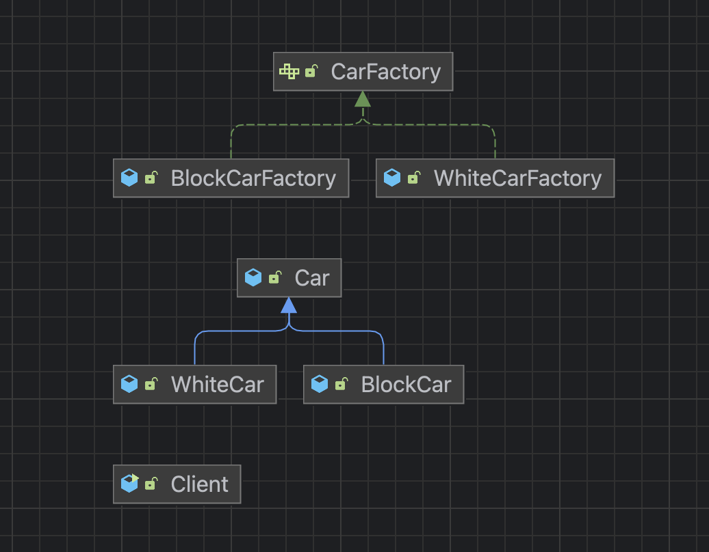

# Factory method pattern : 팩토리 메서드 패턴

- 인스턴스를 생성하는 책임을 추상적인 인터페이스의 메서드로 감싸는 것이다.
- 즉, 서브 클래스가 구체적으로 인스턴스를 생성할 지 결정한다.
- 다양한 구현체(Product)가 있고 그 중에서 특정한 구현체를 만들 수 있는 다양한 팩토리(Creator)를 제공할 수 있다.

## 패턴을 구현해보자.

### 1. Car class

```java
public class Car {
    private String name;
    private String color;
    private String logo;
}
```

- 자동차 클래스를 정의해 준다.
- 이름, 색상, 로고에 대한 데이터를 갖고 있다.

### 2. CarFactory interface

```java
public interface CarFactory {

    default Car orderCar(String name, String email) {
        validate(name, email); // 검사
        prepareFor(name); // 준비
        Car car = createCar(); // 생성
        sendEmailTo(email, car); // 알림
        return car;
    }

    Car createCar();

    private void validate(String name, String email) {
        if (name == null || name.isBlank()) {
            throw new IllegalArgumentException("자동차 이름을 지어주세요.");
        }
        if (email == null || email.isBlank()) {
            throw new IllegalArgumentException("연락처를 남겨주세요.");
        }
    }

    private void prepareFor(String name) {
        System.out.println(name + " 만들 준비 중..");
    }

    private void sendEmailTo(String email, Car car) {
        System.out.println(car.getClass() + " 다 만들었습니다.");
    }
}
```

- Factory를 인터페이스로 만들어 준다.
- default를 통해 자동차 주문에 대한 인터페이스를 생성해 준다.
- 인터페이스 내에서 `검사` `준비` `생성` `알림` 을 진행한다.

### 3. WhiteCar class

```java
public class WhiteCar extends Car {

    public WhiteCar() {
        setName("White Car");
        setLogo("White Logo");
        setColor("White");
    }
}
```

- Car 클래스를 상속 받아서 WhiteCar를 만들어 준다.

### 4. WhiteCarFactory class

```java
public class WhiteCarFactory implements CarFactory {

    @Override
    public Car createCar() {
        return new WhiteCar();
    }

}
```

- CarFactory 인터페이스에 있는 createCar()를 오버라이드 해서 WhiteCar를 리턴해준다.

### 5. Client class

```java
public class Client {
    public static void main(String[] args) {

        Car whiteCar = new WhiteCarFactory().orderCar("WhiteCar", "test@mail.com");
        System.out.println(whiteCar);

    }
}

: 
WhiteCar 만들 준비 중..
class WhiteCar 다 만들었습니다.
Car{name='White Car', color='White', logo='White Logo'}
```

- WhiteCarFactory는 CarFactory 인터페이스의 구현체이다.
- CarFactory 인터페이스에 default로 정의되어 있는 orderCar()를 통해 whiteCar에 대한 주문을 넣는다.
- White Car가 잘 생성 되었다.

## 그럼, Black Car를 생성하려면 어떻게 해야 하나?

### 1. BlockCar class

```java
public class BlackCar extends Car {
    public BlackCar() {
        setName("Black Car");
        setLogo("Black Logo");
        setColor("Black");
    }
}
```

- Car를 상속받아 Black를 만들어준다.

### 2. BlockCarFactory class

```java
public class BlackCarFactory implements CarFactory {
    @Override
    public Car createCar() {
        return new BlackCar();
    }
}
```

- CarFactory 인터페이스를 구현해서 BlackCar를 리턴해 준다.

### 3. Client class

```java
public class Client {
    public static void main(String[] args) {

        Car whiteCar = new WhiteCarFactory().orderCar("WhiteCar", "test@mail.com");
        System.out.println(whiteCar);

        Car blackCar = new BlackCarFactory().orderCar("BlackCar", "test@mail.com");
        System.out.println(blackCar);

    }
}

:
WhiteCar 만들 준비 중..
class WhiteCar 다 만들었습니다.
Car{name='White Car', color='White', logo='White Logo'}
BlackCar 만들 준비 중..
class BlackCar 다 만들었습니다.
Car{name='Black Car', color='Black', logo='Black Logo'}
```

- Black Car가 잘 생성 되었다.
- 체크해 봐야 하는 부분은 Black Car를 생성하면서 White Car의 코드의 변경이 없었다는 것이다.
- 이는 OCP를 만족한다 볼 수 있다.

## 그런데! 문제는 클라이언트 코드가 바뀌었다.

- 새로운 색상의 자동차가 생성 될 때 마다 클라이언트 코드가 변경되는 게 아닌가? 이것이 과연 변경에 닫혀있는 게 맞는가? 이런 의문을 가질 수 있다. 때문에 의존성 주입을 통해 클라이언트 코드를 최대한 변경하지 않는 방법으로 구현해야 한다.

### 1. 변경되는 클라이언트 코드는 DI를 통해 해결할 수 있다.

```java
public class Client {
    public static void main(String[] args) {

        Client client = new Client();
        client.print(new WhiteCarFactory(), "WhiteCar", "test@mail.com");
        client.print(new BlockCarFactory(), "BlockCar", "test@mail.com");
    }

    private void print(CarFactory carFactory, String name, String email) {
        System.out.println(carFactory.orderCar(name, email));
    }
}

:
WhiteCar 만들 준비 중..
class WhiteCar 다 만들었습니다.
Car{name='White Car', color='White', logo='White Logo'}
BlackCar 만들 준비 중..
class BlackCar 다 만들었습니다.
Car{name='Black Car', color='Black', logo='Black Logo'}
```

- 한 클래스 내에 있어서 옳지는 않지만*(DI라고 할 순 없지만)* 다른 클래스로 빼어서 DI를 받아 사용할 수 있다.

## 프로젝트 다이어그램



Block → Black으로 보면 된다.(오타)

- 제품이나 생성 부분에 각각 계층 구조가 있어서 구체적인 팩토리 안에서 구체적인 제품을 만들어내는 게 중요하다.

## Factory method 관련 질문 리스트

### 1. Factory method 장점과 단점은 무엇인가?

- 장점
    - OCP를 적용해서 기존 코드를 건드리지 않고 비슷한 류의 새로운 인스턴스를 다른 방법으로 확장이 가능하다는 장점이 있다.
    - Factory(생성)과 Instance(프로덕트)와의 관계를 느슨하게(loosely coupled) 가져갔기 때문에 OCP를 따를 수 있게 되었다. 즉, 기존 코드를 건드리지 않아 코드가 간결해지고 기존 코드가 복잡해지지도 않게 되었다.
- 단점
    - 팩토리 패턴을 적용하면 각자의 역할을 지정하다 보니 클래스 수가 늘어나 복잡해 진다는 단점이 있다.

### 2. OCP란 무엇인가?

- OCP는 기존 코드를 변경하지 않으면서 새로운 기능을 얼마든지 확장할 수 있는 구조를 만드는 객체 지향 원칙을 말한다.
- Factory method를 통해 OCP를 적용할 수 있다.
- 예시로, 위에서 `하얀 자동차`를 만들고 `검은 자동차`를 추가적으로 만들 때 `하얀 자동차`에 대한 코드 수정이 없었다.

### 3. Java 8에 추가된 default 메서드는 무엇인가?

- 자바 8에 들어간 default를 통해 인터페이스에서 구현체를 만들 수 있게 되었다.
- 기존엔 추상 메서드만 만들 수 있었고 구현 클래스에서 구현했어야 했는데 Java 8부터는 인터페이스에 기본 구현체를 만들 수 있어서 구현하는 인터페이스나 상속 받는 인터페이스에서 사용할 수 있게 되었다.
- 그렇기 때문에 Java 7 이하와 다르게 추상 클래스를 많이 안 쓰게 되었다. 왜냐하면 인터페이스에서 많은 사용이 가능해졌기 때문이다.

### 4. Java 9에 추가된 Private Interface Method는 무엇인가?

- 인터페이스를 구현하는 클래스에서 공통으로 처리하는 메서드 등 구현에 대한 세부 정보를 숨길 수 있고 이는 결과적으로 좀 더 캡슐화 시킬 수 있게 도와주는 메서드이다.
- 9 버전 이전에는 interface에서 pirvate를 사용하면 compile time 에러가 발생한다.

## Factory method 패턴은 어디에서 쓰일까?

### 1. Simple factory method

```java
public class SimpleFactory {
    public Object createProduct(String name) {
        if (name.equals("whiteCar")) {
            return new WhiteCar();
        } else if (name.equals("blackCar")) {
            return new BlackCar();
        }
        throw new IllegalArgumentException(); // 인스턴스가 없으면 예외
    }
}
```

- 단순하게 키워드로 구분하여 인스턴스를 생성하는 팩터리 메서드이다.

### 2. Calender

```java
import java.util.Calendar;
import java.util.Locale;

public class CalendarExample {
    public static void main(String[] args) {
        System.out.println(Calendar.getInstance().getClass());
        System.out.println(Calendar.getInstance(Locale.forLanguageTag("th-TH-x-lvariant-TH")).getClass());
        System.out.println(Calendar.getInstance(Locale.forLanguageTag("ja-JP-x-lvariant-JP")).getClass());
    }
}

:
class java.util.GregorianCalendar
class sun.util.BuddhistCalendar
class java.util.JapaneseImperialCalendar
```

- 각 값에 해당하는 로케일 정보를 넘겨주면 구체적인 타입 값이 나오게 되어 있다.
- Simple factory method가 사용되었다.

```java
public abstract class Calendar implements Serializable, Cloneable, Comparable<Calendar> {
...
if (aLocale.hasExtensions()) {
            String caltype = aLocale.getUnicodeLocaleType("ca");
            if (caltype != null) {
                cal = switch (caltype) {
                    case "buddhist" -> new BuddhistCalendar(zone, aLocale);
                    case "japanese" -> new JapaneseImperialCalendar(zone, aLocale);
                    case "gregory"  -> new GregorianCalendar(zone, aLocale);
                    default         -> null;
                };
            }
        }
...
}
```

- 파라미터 값에 따라 각기 다른 인스턴스를 만들어주는 간단한 형태의 팩터리 메서드가 적용되어 있다.

### 3. Spring Bean Factory

```java
BeanFactory xmlFactory = new ClassPathXmlApplicationContext("config.xml");
BeanFactory javaFactroy = new AnnotationConfigApplicationContext(Config.class);
```

- IoC Bean Factory에 녹아있는 디자인 패턴이 팩터리 메서드 패턴이다.